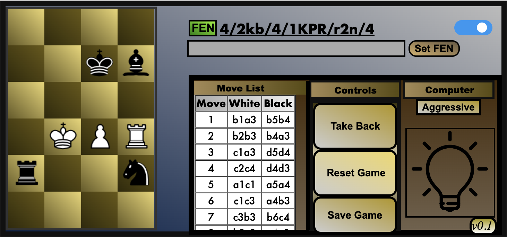

# qkChess

qkChess ("quick chess") is a minichess variation of standard chess.
It features a 6 x 4 board, and each player starts with 4 pawns, a rook, a bishop (each of opposite color), and a knight.

Variations in rules include: 
* No castling
* No en-passant (plans to add)
* Pawn only becomes queen on promotion

qkChess has a playable engine that can be set to three settings:
* Clueless (random move)
* Aggressive (ply 2)
* Strong (ply 4)

The current implementation is Minimax + alpha-beta pruning. It is designed to calculate considering forcing moves, square control, and endgame advantage.

Next steps:
* fix and redesign GUI
    + create features such as load game, look through previous moves
* Improve current engine
    + add best line(s)
* Test MCTS engine
* Attempt to train NN

Long term will attempt to incorporate an engine from a learning algorithm that learns from playing the user.
The user can then play other players or have its trained system play other trained systems.
